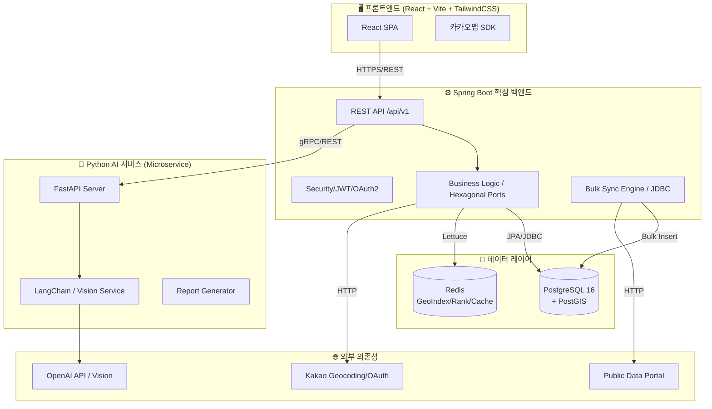

<div align="center">

# 💩 DayPoo

**대한민국 건강한 배변 문화를 위한 공간 정보 및 AI 분석 서비스**

_React · Spring Boot · Python/FastAPI · Hexagonal Architecture · LangChain_

[](https://github.com/cjoh0407-ctrl/daypoo)
[](./frontend)
[](./backend)
[](./ai-service)
[](./LICENSE)

</div>

---

## 📖 프로젝트 소개

**DayPoo(대똥여지도)**는 대한민국 화장실 정보를 지도 위에 시각화하고, 사용자의 배변 기록을 AI로 분석하여 건강 솔루션을 제공하는 **프리미엄 건강 관리 및 위치 기반 서비스**입니다.

전국 **5.5만 건**의 공공데이터를 초고속으로 동기화하는 **벌크 수집 엔진**과 **PostGIS** 기반의 정밀 공간 쿼리, 그리고 **LangChain** 기반의 지능형 리포팅 시스템을 통해 사용자에게 차별화된 가치를 제공합니다.

---

## 🏗️ 시스템 아키텍처 (C4 Model - Container Level)

DayPoo는 비즈니스 로직의 격리와 확장성을 위해 **헥사고날 아키텍처(Hexagonal Architecture)**를 채택하였습니다.



---

## 🛠️ 기술 스택 (Technology Stack)

| 파트           | 기술                           | 설명                                              |
| :------------- | :----------------------------- | :------------------------------------------------ |
| **Frontend**   | React 18+, TypeScript, Vite    | 커스텀 Hooks 기반 SPA, 엄격한 타입 시스템         |
|                | TailwindCSS 4, Zustand         | 유틸리티 퍼스트 스타일링, 가벼운 상태 관리        |
| **Backend**    | Spring Boot 3.4 (Java 21)      | 헥사고날 아키텍처 기반 고가용성 서버              |
|                | JdbcTemplate, JPA, QueryDSL    | 고성능 Bulk Insert 및 정밀 타입 쿼리              |
|                | Spring Security + JWT + OAuth2 | Kakao/Google 소셜 인증 및 Stateless 보안          |
| **AI Service** | FastAPI (Python 3.12)          | LangChain 기반 멀티모달(Vision) 분석 서비스       |
| **Data Layer** | PostgreSQL 16 + PostGIS        | 5.5만 건 공간 데이터 처리 및 공간 인덱싱(GIST)    |
|                | Redis (GeoIndex, ZSET)         | '급똥 지수' 실시간 랭킹 및 쿨다운 매커니즘 캐싱   |
| **DevOps**     | GitHub Actions, Docker, Husky  | 컨테이너 기반 CI/CD 및 자동 코드 포맷팅(Spotless) |

---

## ✨ 핵심 기능 (Core Features)

### 1. 🚨 초고속 벌크 수집 엔진 (Auto-Pilot Sync)

- 전국 5.5만 건의 공공데이터를 **JdbcTemplate Bulk Insert**와 **메모리 필터링**을 통해 수 분 내에 동기화합니다.
- API 오류 발생 시에도 중단 없이 전진하는 **예외 격리 시스템**을 갖추고 있습니다.

### 2. 📍 정밀 좌표 보정 (Kakao Geocoding)

- 좌표가 누락된 공공데이터를 **카카오 지오코딩 API**를 통해 실시간 보정하여 지도 정확도를 극대화합니다.

### 3. 💩 스마트 방문 인증 (4-Step Verification)

- **PostGIS GIST 공간 인덱스**를 활용하여 현재 위치 반경 50m 내 화장실 방문을 0.1초 내에 검증합니다.
- GPS 스푸핑 방지 로직과 Redis 기반 3시간 쿨다운으로 중복 인증을 방지합니다.

---

## 🚀 팀원 시작하기 (Getting Started)

### 사전 준비 (Prerequisites)

- **Node.js** 20+
- **Java JDK 21**
- **Docker & Docker Compose**
- **Git**

### 1단계: 환경 설정 (.env 통합 관리)

> 우리 프로젝트는 루트 폴더의 `.env` 파일을 하나로 통합하여 관리하며, 백엔드는 이를 심볼릭 링크로 참조합니다.

```bash
# 1. 루트 폴더에 .env 파일 생성 및 설정
cp .env.example .env
# KAKAO_CLIENT_ID, DB_URL 등 필수 값 기입
```

### 2단계: 프로젝트 실행 (Docker)

```bash
docker-compose up -d
```

### 3단계: 로컬 개발 환경

- **Frontend**: `cd frontend && npm install && npm run dev` (http://localhost:5173)
- **Backend**: `cd backend && ./gradlew bootRun` (http://localhost:8080)
- **AI Service**: `cd ai-service && pip install -r requirements.txt && python main.py`

---

## 🤝 협업 규칙 (Collaboration Rules)

### 커밋 메시지 규칙 (Commitlint)

반드시 `타입: 제목` 형식을 준수해야 하며, 어길 시 **커밋이 거부**됩니다.
`feat`, `fix`, `docs`, `style`, `refactor`, `test`, `chore` 타입을 사용하세요.

### 코드 자동 포맷팅 (Lint-staged)

`git commit` 시 다음 도구가 자동 실행되어 업계 표준 스타일을 유지합니다:

- **Frontend**: ESLint + Prettier
- **Backend**: Spotless (Google Java Format)
- **AI Service**: Black + Isort

---

## 📁 디렉토리 구조 상세

```
daypoo/
├── .github/ workflows/        # CI/CD (GitHub Actions)
├── frontend/ src/             # React + TailwindCSS SPA
├── backend/ src/ main/ java/ com/ daypoo/ api/
│   ├── adapter/               # Web(IN) / Persistence(OUT) 어댑터
│   ├── application/           # 비즈니스 유즈케이스 및 포트
│   ├── domain/                # 순수 도메인 엔티티 및 로직
│   └── service/               # 도메인 통합 서비스
├── ai-service/ app/           # FastAPI AI 서비스
│   ├── api/ v1/               # 엔드포인트
│   └── services/              # Vision 및 리포트 엔진
├── docs/                      # 아키텍처 및 온보딩 가이드
└── docker-compose.yml         # 로컬 인프라 통합 환경
```

---

## 📅 마일스톤 (Milestones)

- **✅ 2026.03.18 - Phase 2-1: 전국 단위 공공데이터 수집 엔진 구축 완료**
  - 전국 5.5만 건 화장실 데이터 벌크 수집 및 좌표 보정 시스템 완성
- **✅ 2026.03.10 - Phase 1: 초기 개발 인프라 및 협업 규칙 세팅**
  - PostgreSQL/PostGIS, Redis, 헥사고날 구조 및 Spotless 자동화 도입

---

## 📄 라이선스

이 프로젝트는 [ISC License](./LICENSE)를 따릅니다.
