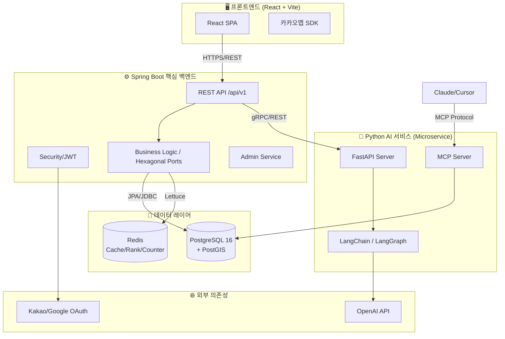

<div align="center">

# 💩 DayPoo

**대한민국 건강한 배변 문화를 위한 공간 정보 및 AI 분석 서비스**

_React · Spring Boot · Python/FastAPI · Hexagonal Architecture · LangChain_

[](https://github.com)
[](./frontend)
[](./backend)
[](./docs/onboarding/plan.md#80-ai-및-데이터-파이프라인)
[](./LICENSE) ※ 준비 중

</div>

---

## 📖 프로젝트 소개

**DayPoo(대똥여지도)**는 대한민국 화장실 정보를 지도 위에 시각화하고, 사용자의 배변 기록을 AI로 분석하여 건강 솔루션을 제공하는 **프리미엄 건강 관리 및 위치 기반 서비스**입니다.

단순한 지도 서비스를 넘어, **헥사고날 아키텍처**를 기반으로 한 견고한 설계와 **LangChain/MCP**를 활용한 지능형 리포팅 시스템을 구축하여 사용자에게 차별화된 가치를 제공합니다.

---

## 🏗️ 시스템 아키텍처 (C4 Model - Container Level)

DayPoo는 비즈니스 로직의 격리와 확장성을 위해 **헥사고날 아키텍처(Hexagonal Architecture)**를 채택하였습니다.



---

## 🛠️ 기술 스택 (Technology Stack)

| 파트           | 기술                         | 설명                                          |
| :------------- | :--------------------------- | :-------------------------------------------- |
| **Frontend**   | React 18+, TypeScript, Vite  | 커스텀 Hooks 기반 SPA, 엄격한 타입 시스템     |
|                | Zustand, Vanilla CSS         | 가벼운 상태 관리, 독자적 Rich UI/UX 스타일링  |
| **Backend**    | Spring Boot 3.x (Java 21)    | 헥사고날 아키텍처 기반 고가용성 서버          |
|                | Spring Security + JWT        | Stateless 인증 및 보안 체계                   |
| **AI Service** | (구현 예정)                  | LangChain 기반 AI 리포트 서비스 개발 계획     |
| **Data Layer** | PostgreSQL 16 + PostGIS      | 공간 데이터 처리 및 ACID 트랜잭션 보장        |
|                | Redis                        | '급똥 지수' 실시간 카운터 및 랭킹 데이터 캐싱 |
| **DevOps**     | GitHub Actions, Docker       | 컨테이너 기반 CI/CD 및 환경 통일              |
|                | Prometheus, Grafana          | 시스템 메트릭 수집 및 시각화                  |

---

## ✨ 핵심 기능 (Core Features)

### 1. 🚨 급똥 대응 추천 (Emergency Top 3)

- PostGIS 공간 쿼리와 거리/운영시간 가중치 알고리즘을 결합하여 현재 위치에서 가장 최적화된 화장실 3곳을 1초 내에 추천합니다.

### 2. 💩 스마트 방문 인증 (4-Step Verification)

- 사진 없는 No-Photo 인증 방식을 채택하여 개인정보를 보호합니다.
- GPS 스푸핑 방지 및 체류 시간 검증을 통해 신뢰도 높은 방문 기록을 생성합니다.

### 3. 🤖 AI 건강 리포트 (Health Analysis)

- LangChain을 통해 사용자의 배변 데이터를 분석하여 맞춤형 건강 조언을 제공합니다.

---

## 🚀 팀원 시작하기 (Getting Started)

### 사전 준비 (Prerequisites)

- **Node.js** 20 이상
- **Java JDK 21**
- **PostgreSQL 16 + PostGIS** (또는 Docker)
- **Git**

---

### 1단계: 저장소 Fork & Clone

> 우리 프로젝트는 **Fork 기반 협업 방식**을 사용합니다. 자세한 워크플로우는 [fork_workflow.md](./docs/onboarding/fork_workflow.md)를 꼭 먼저 읽어주세요!

```bash
# 1. 본인의 GitHub 계정으로 이 저장소를 Fork 합니다.

# 2. Fork한 저장소를 로컬에 Clone 합니다.
git clone https://github.com/<내-깃허브-계정>/daypoo.git
cd daypoo

# 3. 원본 저장소(upstream)를 등록합니다.
git remote add upstream https://github.com/<Organization>/daypoo.git
```

---

### 2단계: 루트 의존성 설치 (Git Hook 활성화)

> **반드시 루트 폴더에서 먼저 실행**해야 Husky(커밋 봇)가 정상 작동합니다!

```bash
# 루트 폴더에서 실행 (최초 1회)
npm install
```

---

### 3단계: 각 파트별 개발 환경 세팅

#### ⚛️ Frontend

```bash
cd frontend
npm install
npm run dev        # http://localhost:5173
```

#### ☕ Backend

```bash
cd backend

# 환경 변수 설정 (.env 또는 application-local.yml 참고)
# DB_URL, DB_USERNAME, DB_PASSWORD 등

./gradlew bootRun  # http://localhost:8080  (Windows: gradlew.bat bootRun)
```

#### 🐳 Docker로 한 번에 실행 (선택)

```bash
# 루트 폴더에서
docker-compose up -d
```

---

## 🤝 협업 규칙 (Collaboration Rules)

> 전체 규칙은 [rules_guide.md](./docs/onboarding/rules_guide.md)를 참고하세요.

### 커밋 메시지 규칙 (Commitlint)

커밋 메시지는 반드시 `타입: 제목` 형식을 따라야 합니다. 어기면 **커밋 자체가 거부**됩니다.

```bash
# ✅ 올바른 예시
git commit -m "feat: 카카오맵 화장실 마커 렌더링 추가"
git commit -m "fix: 로그인 토큰 만료 오류 수정"
git commit -m "docs: README.md 아키텍처 다이어그램 업데이트"

# ❌ 틀린 예시 (커밋 실패)
git commit -m "로그인 추가"            # 타입 없음
git commit -m "Feat: 로그인 추가"     # 타입은 소문자
```

**사용 가능한 타입:**

| 타입       | 용도                    |
| ---------- | ----------------------- |
| `feat`     | 새로운 기능 추가        |
| `fix`      | 버그 수정               |
| `docs`     | 문서 변경               |
| `style`    | UI/CSS 변경 (로직 무관) |
| `refactor` | 코드 리팩토링           |
| `test`     | 테스트 코드             |
| `chore`    | 빌드/패키지 설정 변경   |

### 브랜치 전략

```
main                    # 운영 브랜치 (직접 push 금지)
└── feature/<기능명>    # 기능 개발 (권장)
└── hotfix/<버그명>     # 긴급 버그 수정 (권장)
```

### 코드 자동 포맷팅

`git commit` 시 **Husky + Lint-staged**가 자동으로 작동합니다:

| 파트                  | 도구                          |
| --------------------- | ----------------------------- |
| Frontend (JS/JSX/CSS) | ESLint + Prettier             |
| Backend (Java)        | Spotless (Google Java Format) |

---

## 📁 디렉토리 구조 상세

```
daypoo/
├── .github/
│   ├── workflows/             # CI/CD (GitHub Actions)
│   │   ├── ci.yml
│   │   ├── deploy.yml
│   │   └── auto-push-pr.yml
│   └── ISSUE_TEMPLATE/        # 이슈/PR 템플릿
├── .husky/                    # Git Hook 설정
├── frontend/
│   ├── src/
│   │   ├── components/        # 재사용 UI 컴포넌트
│   │   ├── pages/             # 라우팅 페이지
│   │   ├── store/             # Zustand 상태 관리
│   │   └── api/               # Axios API 모듈
│   └── vite.config.js
├── backend/
│   └── src/main/java/com/ddmap/backend/
│       ├── adapter/           # 인프라 계정 (in: Web, out: Persistence)
│       ├── application/       # 비즈니스 유즈케이스 및 포트
│       └── domain/            # 순수 도메인 엔티티 및 로직
├── docs/
│   ├── onboarding/            # 온보딩 가이드 (시작하기, 협업 규칙, 히스토리)
│   ├── architecture/          # 아키텍처 다이어그램 및 설계 문서
│   └── swagger/               # API 명세 및 연구 자료
├── docker-compose.yml
├── commitlint.config.js
└── package.json               # 루트 (Husky/Commitlint 관리)
```

---

## 📅 프로젝트 히스토리

### 🚀 2026년 3월 4일 - Phase 1: 초기 개발 환경 세팅 완료

본격적인 기능 구현(Phase 2)에 앞서 팀원들과의 원활한 협업을 위한 **초기 환경 세팅 및 공통 가이드**가 완료되었습니다.

- **✅ 각 파트별 스캐폴딩 및 Lint 구축**
- **✅ 중앙 집중형 협업 시스템 (Git Hook) 도입**
- **✅ 팀원 협업 온보딩 가이드라인 가동**

---

## 📄 라이선스

이 프로젝트는 [ISC License](./LICENSE)를 따릅니다. (준비 중)
