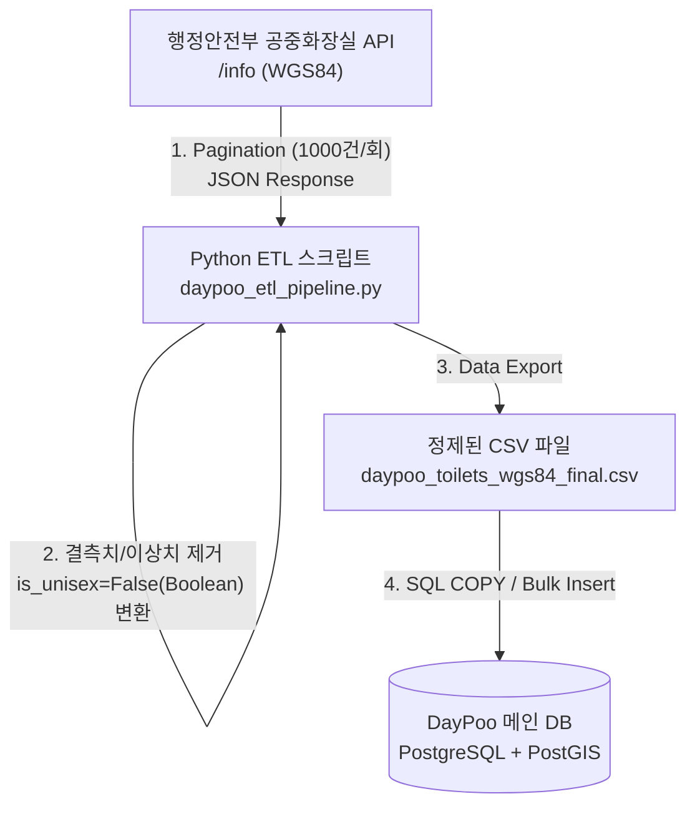

# [API Reference] 행정안전부 공중화장실정보 조회서비스

tags: API, Assist, BE
status: 활용
ai: NotebookLM
created: 2026/03/17
updated: 2026/03/17
URL: https://www.data.go.kr/data/15155058/openapi.do#/layer-api-guide

# [API Reference] 행정안전부 공중화장실정보 조회서비스

## **🚀 프로덕션 적용을 위한 파이썬 스크립트**

```python
import os
import sys
import logging
import time
import urllib3
import requests
import pandas as pd
from dotenv import load_dotenv

# 공공 API 특성상 발생하는 SSL 인증서 경고 숨김 처리
urllib3.disable_warnings(urllib3.exceptions.InsecureRequestWarning)

# 로깅 설정
logging.basicConfig(level=logging.INFO, format="%(asctime)s [%(levelname)s] %(message)s")
logger = logging.getLogger(__name__)

# --- [1] Configuration ---
load_dotenv()
API_KEY = os.getenv("PUBLIC_DATA_API_KEY")

if not API_KEY:
    raise ValueError("🚨 .env 파일에 PUBLIC_DATA_API_KEY가 설정되지 않았습니다!")

BASE_URL = "https://apis.data.go.kr/1741000/public_restroom_info/info"
SUCCESS_CODES = {"0", "00", "200"}
NUM_OF_ROWS = 1000

def _get_page(page_no: int) -> dict:
    """단일 페이지 요청. JSON 파싱 실패 시 예외를 발생시킵니다."""
    params = {
        "serviceKey": API_KEY,
        "pageNo": str(page_no),
        "numOfRows": str(NUM_OF_ROWS),
        "returnType": "json",
    }
    
    response = requests.get(BASE_URL, params=params, verify=False, timeout=15)
    response.raise_for_status()
    
    try:
        return response.json()
    except requests.exceptions.JSONDecodeError:
        raise ValueError(f"JSON 파싱 실패. 응답 내용: {response.text[:300]}")

def fetch_all_toilet_data() -> list:
    """행정안전부 API에서 페이지네이션을 돌며 전체 데이터를 수집합니다."""
    all_data = []
    page_no = 1
    total_count = None

    logger.info("[Extract] 전체 데이터 수집 시작")

    while True:
        try:
            data = _get_page(page_no)
        except Exception as e:
            logger.error(f"페이지 {page_no} 요청 실패: {e}")
            break

        # API 내부 결과 코드 검증
        header = data.get("response", {}).get("header", {})
        result_code = str(header.get("resultCode", ""))
        
        if result_code not in SUCCESS_CODES:
            logger.error(f"API 내부 오류 (code: {result_code}, msg: {header.get('resultMsg')})")
            break

        body = data.get("response", {}).get("body", {}) or {}

        # 최초 호출 시 전체 데이터 건수 파악
        if total_count is None:
            total_count = int(body.get("totalCount", 0))
            logger.info(f"총 {total_count}건의 데이터 발견. 수집을 진행합니다.")

        items_obj = body.get("items") or {}
        if not items_obj or "item" not in items_obj:
            logger.warning(f"페이지 {page_no}: 데이터 없음. 수집 종료.")
            break

        item_list = items_obj["item"]
        
        # 공공데이터 API 엣지 케이스 처리 (단일 건 응답 시 dict로 반환되는 경우 방어)
        if isinstance(item_list, dict):
            item_list = [item_list]

        all_data.extend(item_list)
        logger.info(f"페이지 {page_no} 수집 완료 (누적 {len(all_data)}건)")

        if len(all_data) >= total_count:
            break

        page_no += 1
        time.sleep(0.5) # 서버 부하 방지 딜레이

    return all_data

def transform_data(raw_data: list) -> pd.DataFrame:
    """수집된 데이터를 DayPoo DB 스키마에 맞게 정제하고 이상치를 필터링합니다."""
    logger.info("[Transform] WGS84 데이터 정제 및 결측치 제거 시작")
    df = pd.DataFrame(raw_data)

    # 1. DayPoo ERD에 필요한 컬럼 추출 및 매핑
    columns_mapping = {
        "RSTRM_NM": "name",
        "LCTN_ROAD_NM_ADDR": "road_address",
        "LCTN_LOTNO_ADDR": "land_address",
        "WGS84_LAT": "latitude",
        "WGS84_LOT": "longitude",
        "OPN_HR": "open_time",
    }
    
    existing_cols = {k: v for k, v in columns_mapping.items() if k in df.columns}
    df = df[list(existing_cols.keys())].rename(columns=existing_cols)

    # 2. 주소 병합 (도로명 우선, 없으면 지번, 둘 다 없으면 '주소 없음')
    if "road_address" in df.columns and "land_address" in df.columns:
        df["address"] = df["road_address"].fillna(df["land_address"]).fillna("주소 없음")
    elif "road_address" in df.columns:
        df["address"] = df["road_address"].fillna("주소 없음")
    elif "land_address" in df.columns:
        df["address"] = df["land_address"].fillna("주소 없음")
    else:
        df["address"] = "주소 없음"

    for col in ("road_address", "land_address"):
        if col in df.columns:
            df = df.drop(columns=[col])

    # 3. 데이터 타입 변환
    df["latitude"] = pd.to_numeric(df["latitude"], errors="coerce")
    df["longitude"] = pd.to_numeric(df["longitude"], errors="coerce")

    initial_count = len(df)
    
    # 4. 결측치 및 WGS84 대한민국 정상 바운더리 통과 데이터만 유지
    valid_mask = (
        df["latitude"].notna() & df["longitude"].notna() &
        df["latitude"].between(33.0, 39.0) &
        df["longitude"].between(124.0, 132.0)
    )
    df = df[valid_mask]
    
    # 5. 남녀공용 여부 (PostgreSQL BOOLEAN 타입 일치를 위해 False 지정)
    df["is_unisex"] = False

    logger.info(f"제거된 이상 데이터: {initial_count - len(df)}건 / 최종 유효 적재 데이터: {len(df)}건")
    return df

def load_to_csv(df: pd.DataFrame, filename: str = "daypoo_toilets_wgs84_final.csv") -> None:
    """정제된 데이터를 백엔드 DB Seed용 CSV 파일로 추출합니다."""
    logger.info(f"[Load] 정제된 데이터를 '{filename}' 파일로 저장합니다...")
    # 엑셀/DB 인코딩 깨짐 방지
    df.to_csv(filename, index=False, encoding="utf-8-sig")
    logger.info("🚀 저장 완료. 백엔드 Bulk Insert를 진행해주세요.")

if __name__ == "__main__":
    raw_data = fetch_all_toilet_data()
    if raw_data:
        cleaned_df = transform_data(raw_data)
        load_to_csv(cleaned_df)
    else:
        logger.error("데이터 수집 실패. API 키, 네트워크 상태, 파라미터를 다시 확인해주세요.")
        sys.exit(1)
```

### 💡 주요 변경 및 검토 포인트

1. **`resultCode` 확인 로직 추가**: 데이터를 파싱하기 전에 응답 `header`의 `resultCode`를 확인하여 "0" (정상) 인지 검증하는 부분을 추가했습니다. 만약 트래픽이 초과되었다면 상태 코드는 200이 뜨더라도 내부 `resultCode`는 "-10"으로 반환되므로 이를 정확히 걸러낼 수 있습니다.
2. **`JSONDecodeError` 방어 코드**: 간혹 공공 API 서버 장애나 인증키 문제 시 `returnType='json'`을 명시했음에도 강제로 XML 에러 페이지를 반환하는 경우가 있습니다. 이를 대비해 `response.json()`을 안전하게 `try-except`로 감쌌습니다.
3. **데이터 구조 일치 확인**: 추출하시는 `RSTRM_NM`, `LCTN_ROAD_NM_ADDR`, `WGS84_LAT`, `WGS84_LOT` 파라미터는 명세서의 제공 데이터 구조와 정확히 일치합니다.

- **🧪 파이프라인 검증용 테스트 스크립트 (이 스크립트로 테스트해서 코드 검증함)**
    
    ```python
    import os
    import sys
    import logging
    import time
    import urllib3
    import requests
    import pandas as pd
    from dotenv import load_dotenv
    
    urllib3.disable_warnings(urllib3.exceptions.InsecureRequestWarning)
    
    logging.basicConfig(level=logging.INFO, format="%(asctime)s [%(levelname)s] %(message)s")
    logger = logging.getLogger(__name__)
    
    # --- [1] Configuration ---
    load_dotenv()
    API_KEY = os.getenv("PUBLIC_DATA_API_KEY")
    
    if not API_KEY:
        raise ValueError("🚨 .env 파일에 PUBLIC_DATA_API_KEY가 설정되지 않았습니다!")
    
    BASE_URL = "https://apis.data.go.kr/1741000/public_restroom_info/info"
    SUCCESS_CODES = {"0", "00", "200"}
    NUM_OF_ROWS = 50  # 🚀 [테스트 세팅] 빠른 검증을 위해 50건만 호출
    MAX_TEST_PAGES = 1 # 🚀 [테스트 세팅] 1페이지 호출 후 강제 종료
    
    def _get_page(page_no: int) -> dict:
        params = {
            "serviceKey": API_KEY,
            "pageNo": str(page_no),
            "numOfRows": str(NUM_OF_ROWS),
            "returnType": "json",
        }
        
        response = requests.get(BASE_URL, params=params, verify=False, timeout=15)
        response.raise_for_status()
        
        try:
            return response.json()
        except requests.exceptions.JSONDecodeError:
            raise ValueError(f"JSON 파싱 실패. 응답 내용: {response.text[:300]}")
    
    def fetch_all_toilet_data() -> list:
        all_data = []
        page_no = 1
    
        logger.info("🧪 [Extract] 테스트용 데이터 수집 시작 (50건 제한)")
    
        while page_no <= MAX_TEST_PAGES:
            try:
                data = _get_page(page_no)
            except Exception as e:
                logger.error(f"페이지 {page_no} 요청 실패: {e}")
                break
    
            header = data.get("response", {}).get("header", {})
            result_code = str(header.get("resultCode", ""))
            
            if result_code not in SUCCESS_CODES:
                logger.error(f"API 내부 오류 (code: {result_code}, msg: {header.get('resultMsg')})")
                break
    
            body = data.get("response", {}).get("body", {}) or {}
            items_obj = body.get("items") or {}
            
            if not items_obj or "item" not in items_obj:
                logger.warning("데이터가 없습니다. 수집 종료.")
                break
    
            item_list = items_obj["item"]
            if isinstance(item_list, dict):
                item_list = [item_list]
    
            all_data.extend(item_list)
            logger.info(f"페이지 {page_no} 수집 완료 (누적 {len(all_data)}건)")
            
            page_no += 1
            time.sleep(0.5)
    
        return all_data
    
    def transform_data(raw_data: list) -> pd.DataFrame:
        logger.info("🧪 [Transform] WGS84 데이터 정제 및 결측치 제거 시작")
        df = pd.DataFrame(raw_data)
    
        columns_mapping = {
            "RSTRM_NM": "name",
            "LCTN_ROAD_NM_ADDR": "road_address",
            "LCTN_LOTNO_ADDR": "land_address",
            "WGS84_LAT": "latitude",
            "WGS84_LOT": "longitude",
            "OPN_HR": "open_time",
        }
        
        existing_cols = {k: v for k, v in columns_mapping.items() if k in df.columns}
        df = df[list(existing_cols.keys())].rename(columns=existing_cols)
    
        if "road_address" in df.columns and "land_address" in df.columns:
            df["address"] = df["road_address"].fillna(df["land_address"]).fillna("주소 없음")
        elif "road_address" in df.columns:
            df["address"] = df["road_address"].fillna("주소 없음")
        elif "land_address" in df.columns:
            df["address"] = df["land_address"].fillna("주소 없음")
        else:
            df["address"] = "주소 없음"
    
        for col in ("road_address", "land_address"):
            if col in df.columns:
                df = df.drop(columns=[col])
    
        df["latitude"] = pd.to_numeric(df["latitude"], errors="coerce")
        df["longitude"] = pd.to_numeric(df["longitude"], errors="coerce")
    
        initial_count = len(df)
        
        valid_mask = (
            df["latitude"].notna() & df["longitude"].notna() &
            df["latitude"].between(33.0, 39.0) &
            df["longitude"].between(124.0, 132.0)
        )
        df = df[valid_mask]
        df["is_unisex"] = False
    
        logger.info(f"테스트 데이터 필터링 완료: 제거됨 {initial_count - len(df)}건 / 최종 유효 {len(df)}건")
        return df
    
    def load_to_csv(df: pd.DataFrame, filename: str = "daypoo_toilets_test.csv") -> None:
        logger.info(f"🧪 [Load] 정제된 데이터를 '{filename}' 파일로 저장합니다...")
        df.to_csv(filename, index=False, encoding="utf-8-sig")
        logger.info("🎉 테스트 완료! 폴더에서 생성된 CSV 파일을 열어 확인해보세요.")
    
    if __name__ == "__main__":
        raw_data = fetch_all_toilet_data()
        if raw_data:
            cleaned_df = transform_data(raw_data)
            load_to_csv(cleaned_df)
        else:
            logger.error("데이터 수집 실패. API 상태를 확인하세요.")
            sys.exit(1)
    ```
    

## 공공데이터 ETL 데이터 흐름도



---

### 1. 서비스 기본 정보

- **서비스명**: [행정안전부_공중화장실정보 조회서비스](https://www.data.go.kr/data/15155058/openapi.do#/layer-api-guide)
- **제공 기관**: 행정안전부 (지역디지털협력과: 044-205-2770)
- **데이터 소관 부서**: 행정안전부 주소정보혁신과 (044-205-3545)
- **API 유형 / 포맷**: REST / JSON+XML
- **좌표계**: WGS84 위경도 좌표계
- **트래픽 제한**: 개발계정 일 10,000건 / 운영계정은 활용사례 등록 후 신청 시 증가 가능

---

### 2. 정확한 API 호출 URL 구조 (필수 확인)

문서상 기본 Base URL은 `apis.data.go.kr/1741000/public_restroom_info`로 표기되어 있으나, 실제 통신을 위해서는 **지원하는 Scheme(`http` 또는 `https`)과 조회할 Endpoint를 반드시 결합**해야 합니다.

- **지원 Scheme**: `https`, `http`
- **엔드포인트 (Endpoints)**:
    - `GET /info`: 공중화장실정보 데이터 조회
    - `GET /history`: 공중화장실정보 데이터 이력조회
- **✅ 최종 완성된 실제 호출 URL (데이터 조회용)**:
**`https://apis.data.go.kr/1741000/public_restroom_info/info`**

---

### 3. 요청 파라미터 (Request Parameters - `/info` 기준)

모든 파라미터는 Query String 방식으로 전달해야 합니다.

| 파라미터명 (Name) | 타입 | 필수여부 | 설명 |
| --- | --- | --- | --- |
| **`serviceKey`** | string | **필수** | 공공데이터포털에서 발급받은 인증키 |
| **`pageNo`** | string | **필수** | 페이지 번호 |
| **`numOfRows`** | string | **필수** | 한 페이지 결과 수 (최대 100) |
| `returnType` | string | 선택 | 응답의 데이터 타입 (JSON/XML) |
| `cond[LCTN_ROAD_NM_ADDR::LIKE]` | string | 선택 | 소재지도로명주소 을(를) 포함하는 값 |
| `cond[OPN_ATMY_GRP_CD::EQ]` | string | 선택 | 개방자치단체코드 (예: 서울특별시 6110000, 종로구 3000000 등) |
| `cond[DAT_CRTR_YMD::GTE]` | string | 선택 | 데이터기준일자 이상의 값 (YYYYMMDD) |
| `cond[DAT_CRTR_YMD::LT]` | string | 선택 | 데이터기준일자 미만의 값 (YYYYMMDD) |
| `cond[LAST_MDFCN_PNT::GTE]` | string | 선택 | 최종수정시점 이상의 값 (YYYYMMDDHHMMSS) |
| `cond[LAST_MDFCN_PNT::LT]` | string | 선택 | 최종수정시점 미만의 값 (YYYYMMDDHHMMSS) |

---

### 4. 응답 구조 및 데이터 모델 (Response Model)

성공 시 응답 구조는 최상위 `response` 하위에 `header`와 `body`로 나뉩니다.

**[공통 응답 구조]**

- `response.header.resultCode`: 응답 결과 코드
- `response.header.resultMsg`: 응답 결과 메시지
- `response.body.dataType`: 응답의 데이터 타입
- `response.body.totalCount`: 전체 응답 데이터 수
- `response.body.numOfRows`: 한 페이지 결과 수
- `response.body.pageNo`: 페이지 번호
- **`response.body.items.item`**: 개별 화장실 정보 객체를 담은 배열

**[주요 item 세부 필드 (info_response 모델)]**

- `MNG_NO`: 관리번호
- `RSTRM_NM`: 화장실명
- `OPN_ATMY_GRP_CD`: 개방자치단체코드
- `LCTN_ROAD_NM_ADDR`: 소재지도로명주소
- `LCTN_LOTNO_ADDR`: 소재지지번주소
- `WGS84_LAT`: WGS84위도
- `WGS84_LOT`: WGS84경도
- `MNG_INST_NM`: 관리기관명
- `TELNO`: 전화번호
- `OPN_HR` / `OPN_HR_DTL`: 개방시간 / 개방시간상세
- `MALE_TOILT_CNT` / `MALE_URNL_CNT`: 남성용-대변기수 / 남성용-소변기수
- `FEMALE_TOILT_CNT`: 여성용-대변기수
- *(기타 장애인/어린이용 변기수, CCTV, 비상벨, 기저귀교환대, 수정일자 등 상세 필드 제공)*

---

### 5. 공식 오류 코드 (Error Codes)

API 서버가 반환하는 내부 `resultCode` 목록입니다. 시스템 내 오류 핸들링 시 다음 코드를 정확히 예외 처리해야 합니다.

- **`200`**: 성공
- **`1`**: 시스템 내부 오류가 발생하였습니다.
- **`2`**: 요청하신 파라미터가 적합하지 않습니다.
- **`3`**: 등록되지 않은 서비스 입니다.
- **`4`**: 등록되지 않은 인증키 입니다.
- **`5`**: API 서버 오류가 발생하였습니다.
- **`9`**: 종료된 서비스 입니다.
- **`10`**: 트래픽 허용 횟수를 초과하였습니다.
- **`11`**: 필수 파라미터가 입력되지 않았습니다.
- **`999`**: UNKNOWN

---

### 💡 주요 개발 팁

1. **필수 파라미터 철자 주의**: `serviceKey`, `pageNo`, `numOfRows`는 대소문자를 포함해 반드시 정확하게 전달해야 에러(특히 `11`)를 방지할 수 있습니다.
2. **트래픽 초과 응답 처리**: HTTP 200 상태코드이더라도, 일일 호출량(10,000건)을 넘기면 `resultCode: "-10"`이 반환되므로 바디 파싱 시 이 값을 가장 먼저 검증해야 합니다.