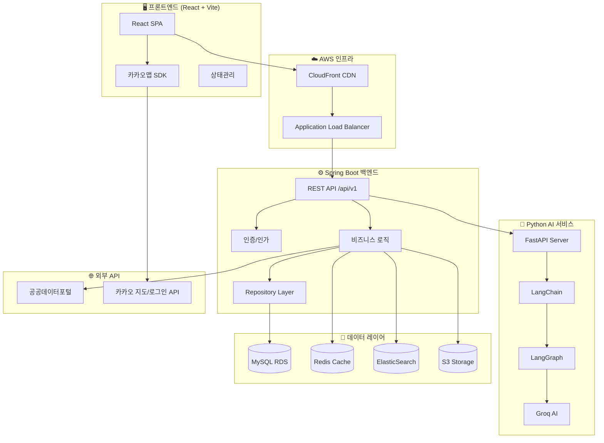
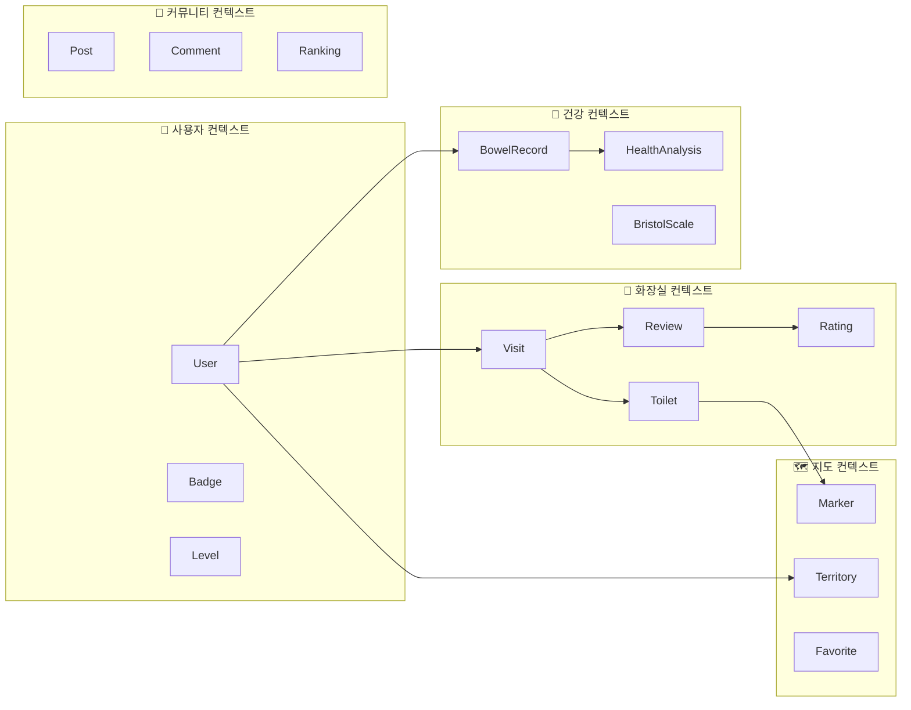
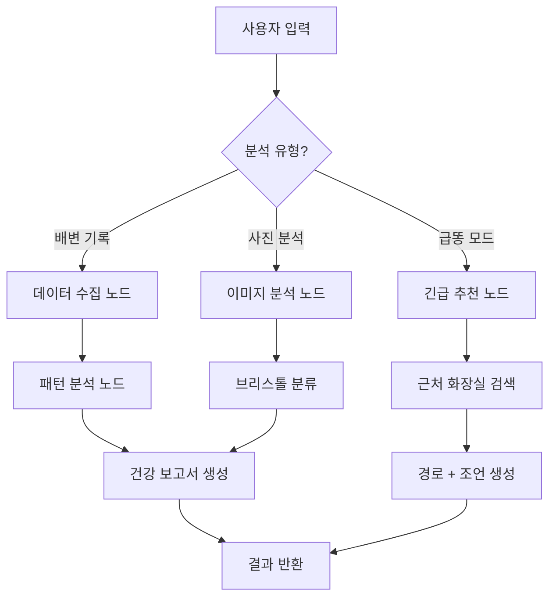
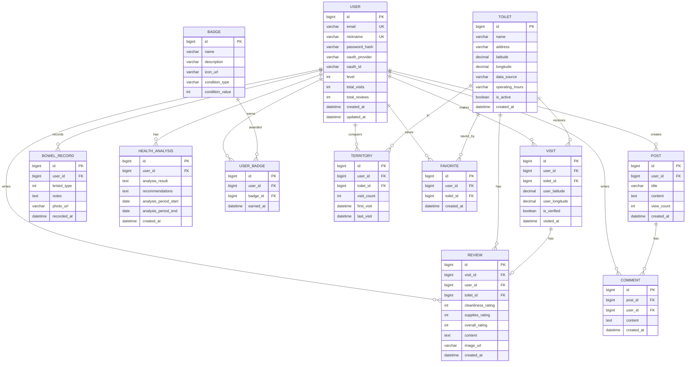
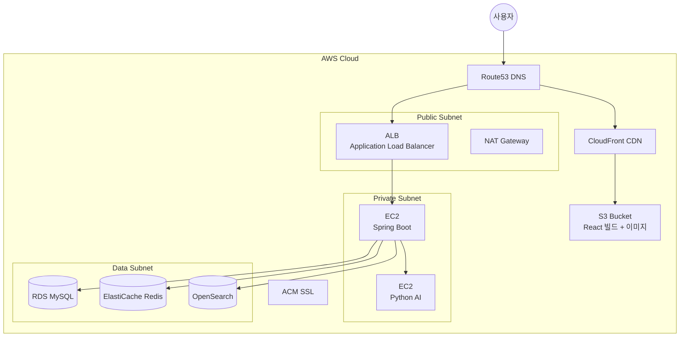

# 대똥여지도 (똥맵) 시스템 아키텍처 설계서

> **skills.sh 참조 스킬**: `architecture-patterns`, `api-design-principles`, `writing-plans`  
> **설계 원칙**: Hexagonal Architecture + DDD + RESTful API Design + TDD

---

## 1. 시스템 전체 아키텍처



---

## 2. 도메인 모델 (DDD Bounded Contexts)



---

## 3. 서비스별 상세 설계

### 3.1 프론트엔드 (React + Vite)

#### 디렉터리 구조
```
frontend/
├── public/
│   └── assets/              # 이모지, 아이콘 등 정적 파일
├── src/
│   ├── api/                  # API 호출 모듈 (axios 인스턴스)
│   │   ├── axiosInstance.js
│   │   ├── toiletApi.js
│   │   ├── authApi.js
│   │   ├── healthApi.js
│   │   └── communityApi.js
│   ├── components/           # 재사용 컴포넌트
│   │   ├── common/           # Button, Modal, Header, Footer
│   │   ├── map/              # KakaoMap, Marker, MarkerPopup, MarkerDetail
│   │   ├── auth/             # LoginForm, SignupForm, SocialLogin
│   │   ├── review/           # ReviewForm, RatingEmoji, BristolScale
│   │   ├── health/           # HealthDashboard, BowelChart, PoopRhythm
│   │   └── community/       # PostList, PostDetail, CommentSection
│   ├── pages/                # 라우트별 페이지
│   │   ├── LandingPage.jsx
│   │   ├── MapPage.jsx
│   │   ├── RankingPage.jsx
│   │   ├── FaqPage.jsx
│   │   ├── BoardPage.jsx
│   │   ├── MyPage.jsx
│   │   └── HealthPage.jsx
│   ├── hooks/                # 커스텀 훅
│   │   ├── useGeolocation.js
│   │   ├── useKakaoMap.js
│   │   └── useAuth.js
│   ├── store/                # 상태 관리 (Zustand)
│   │   ├── authStore.js
│   │   ├── mapStore.js
│   │   └── healthStore.js
│   ├── styles/               # CSS 모듈
│   ├── utils/                # 유틸리티 함수
│   ├── App.jsx
│   └── main.jsx
├── .env
├── vite.config.js
└── package.json
```

#### 핵심 라이브러리
| 라이브러리 | 용도 |
|-----------|------|
| `react-router-dom` | 라우팅 |
| `zustand` | 전역 상태 관리 |
| `axios` | HTTP 클라이언트 |
| `react-kakao-maps-sdk` | 카카오맵 리액트 래퍼 |
| `framer-motion` | 애니메이션 (이모지 이펙트) |
| `recharts` | 똥체리듬 차트 |
| `react-hook-form` | 폼 관리 |

---

### 3.2 백엔드 (Spring Boot) — Hexagonal Architecture

#### 디렉터리 구조
```
backend/
├── src/main/java/com/ddmap/
│   ├── DdmapApplication.java
│   │
│   ├── domain/                            # 🟢 도메인 코어 (비즈니스 로직)
│   │   ├── user/
│   │   │   ├── model/                     # Entity, Value Object
│   │   │   │   ├── User.java
│   │   │   │   ├── Badge.java
│   │   │   │   └── UserLevel.java
│   │   │   ├── port/
│   │   │   │   ├── in/                    # 인바운드 포트 (Use Case)
│   │   │   │   │   ├── RegisterUserUseCase.java
│   │   │   │   │   └── GetUserProfileUseCase.java
│   │   │   │   └── out/                   # 아웃바운드 포트 (Repository)
│   │   │   │       └── UserRepositoryPort.java
│   │   │   └── service/                   # 도메인 서비스
│   │   │       └── UserService.java
│   │   │
│   │   ├── toilet/
│   │   │   ├── model/
│   │   │   │   ├── Toilet.java
│   │   │   │   ├── Visit.java
│   │   │   │   ├── Review.java
│   │   │   │   └── Rating.java
│   │   │   ├── port/
│   │   │   │   ├── in/
│   │   │   │   │   ├── SearchToiletUseCase.java
│   │   │   │   │   ├── VerifyVisitUseCase.java
│   │   │   │   │   └── ReviewToiletUseCase.java
│   │   │   │   └── out/
│   │   │   │       ├── ToiletRepositoryPort.java
│   │   │   │       └── ToiletSearchPort.java
│   │   │   └── service/
│   │   │       ├── ToiletService.java
│   │   │       └── VisitVerificationService.java
│   │   │
│   │   ├── map/
│   │   │   ├── model/
│   │   │   │   ├── Marker.java
│   │   │   │   ├── MarkerLevel.java       # GRAY/BROWN/SILVER/GOLD
│   │   │   │   ├── Territory.java
│   │   │   │   └── Favorite.java
│   │   │   ├── port/
│   │   │   │   ├── in/
│   │   │   │   │   ├── GetMarkersUseCase.java
│   │   │   │   │   └── ManageTerritoryUseCase.java
│   │   │   │   └── out/
│   │   │   │       └── MarkerRepositoryPort.java
│   │   │   └── service/
│   │   │       └── MapService.java
│   │   │
│   │   ├── health/
│   │   │   ├── model/
│   │   │   │   ├── BowelRecord.java
│   │   │   │   ├── BristolType.java       # Enum (7가지)
│   │   │   │   └── HealthAnalysis.java
│   │   │   ├── port/
│   │   │   │   ├── in/
│   │   │   │   │   ├── RecordBowelUseCase.java
│   │   │   │   │   └── AnalyzeHealthUseCase.java
│   │   │   │   └── out/
│   │   │   │       ├── BowelRecordRepositoryPort.java
│   │   │   │       └── AiAnalysisPort.java
│   │   │   └── service/
│   │   │       └── HealthService.java
│   │   │
│   │   └── community/
│   │       ├── model/
│   │       │   ├── Post.java
│   │       │   ├── Comment.java
│   │       │   └── Ranking.java
│   │       ├── port/
│   │       │   ├── in/
│   │       │   └── out/
│   │       └── service/
│   │
│   ├── adapter/                           # 🔵 어댑터 (외부 연동)
│   │   ├── in/                            # 인바운드 어댑터
│   │   │   └── web/                       # REST 컨트롤러
│   │   │       ├── user/
│   │   │       │   ├── UserController.java
│   │   │       │   ├── dto/
│   │   │       │   │   ├── UserRequest.java
│   │   │       │   │   └── UserResponse.java
│   │   │       ├── toilet/
│   │   │       │   ├── ToiletController.java
│   │   │       │   ├── dto/
│   │   │       ├── map/
│   │   │       │   ├── MapController.java
│   │   │       │   ├── dto/
│   │   │       ├── health/
│   │   │       │   ├── HealthController.java
│   │   │       │   ├── dto/
│   │   │       └── community/
│   │   │           ├── CommunityController.java
│   │   │           ├── dto/
│   │   │
│   │   └── out/                           # 아웃바운드 어댑터
│   │       ├── persistence/               # DB 어댑터
│   │       │   ├── user/
│   │       │   │   ├── UserJpaEntity.java
│   │       │   │   ├── UserJpaRepository.java
│   │       │   │   ├── UserPersistenceAdapter.java
│   │       │   │   └── UserMapper.java
│   │       │   ├── toilet/
│   │       │   ├── map/
│   │       │   ├── health/
│   │       │   └── community/
│   │       ├── search/                    # ElasticSearch 어댑터
│   │       │   └── ToiletSearchAdapter.java
│   │       ├── ai/                        # Python AI 서비스 어댑터
│   │       │   └── AiAnalysisAdapter.java
│   │       ├── external/                  # 외부 API 어댑터
│   │       │   ├── PublicDataAdapter.java
│   │       │   └── KakaoApiAdapter.java
│   │       └── cache/                     # Redis 어댑터
│   │           └── MarkerCacheAdapter.java
│   │
│   └── infrastructure/                    # 🟡 인프라 설정
│       ├── config/
│       │   ├── SecurityConfig.java
│       │   ├── WebConfig.java
│       │   ├── RedisConfig.java
│       │   ├── ElasticSearchConfig.java
│       │   └── SwaggerConfig.java
│       ├── security/
│       │   ├── jwt/
│       │   │   ├── JwtTokenProvider.java
│       │   │   └── JwtAuthFilter.java
│       │   └── oauth2/
│       │       ├── KakaoOAuth2Service.java
│       │       └── GoogleOAuth2Service.java
│       └── exception/
│           ├── GlobalExceptionHandler.java
│           └── ErrorResponse.java
│
├── src/main/resources/
│   ├── application.yml
│   ├── application-dev.yml
│   └── application-prod.yml
├── build.gradle
└── Dockerfile
```

---

### 3.3 AI 서비스 (Python + FastAPI + LangChain + LangGraph)

#### 디렉터리 구조
```
ai-service/
├── app/
│   ├── main.py                  # FastAPI 엔트리포인트
│   ├── api/
│   │   ├── router.py            # API 라우터
│   │   └── schemas.py           # Pydantic 모델
│   ├── chains/
│   │   ├── health_analysis.py   # 건강분석 체인
│   │   ├── toilet_recommend.py  # 화장실 추천 체인
│   │   └── emergency_mode.py    # 급똥모드 체인
│   ├── graphs/
│   │   ├── analysis_graph.py    # LangGraph 분석 워크플로우
│   │   └── nodes/
│   │       ├── data_collector.py
│   │       ├── analyzer.py
│   │       └── report_generator.py
│   ├── models/
│   │   └── groq_client.py       # Groq AI 클라이언트
│   ├── prompts/
│   │   ├── health_prompt.py
│   │   ├── recommend_prompt.py
│   │   └── emergency_prompt.py
│   └── config.py
├── requirements.txt
├── Dockerfile
└── tests/
```

#### LangGraph 워크플로우 설계


---

### 3.4 데이터베이스 스키마 (MySQL)



---

## 4. REST API 엔드포인트 설계

> **원칙**: 리소스 지향 URL, API 버전 관리(`/api/v1/`), 일관된 응답 형식

### 4.1 공통 응답 형식
```json
{
  "success": true,
  "data": { ... },
  "error": null,
  "pagination": {
    "page": 1,
    "size": 20,
    "totalElements": 100,
    "totalPages": 5
  }
}
```

### 4.2 엔드포인트 목록

#### 인증
| Method | URL | 설명 |
|--------|-----|------|
| POST | `/api/v1/auth/signup` | 회원가입 |
| POST | `/api/v1/auth/login` | 로그인 |
| POST | `/api/v1/auth/oauth/kakao` | 카카오 소셜 로그인 |
| POST | `/api/v1/auth/oauth/google` | 구글 소셜 로그인 |
| POST | `/api/v1/auth/refresh` | 토큰 갱신 |

#### 사용자
| Method | URL | 설명 |
|--------|-----|------|
| GET | `/api/v1/users/me` | 내 프로필 |
| PATCH | `/api/v1/users/me` | 프로필 수정 |
| GET | `/api/v1/users/me/badges` | 내 뱃지 목록 |
| GET | `/api/v1/users/me/territories` | 내 영역 목록 |
| GET | `/api/v1/users/me/favorites` | 즐겨찾기 목록 |

#### 화장실 / 지도
| Method | URL | 설명 |
|--------|-----|------|
| GET | `/api/v1/toilets` | 화장실 목록 (지도 영역 기반) |
| GET | `/api/v1/toilets/{id}` | 화장실 상세 |
| GET | `/api/v1/toilets/search?q=` | 화장실 검색 (ElasticSearch) |
| GET | `/api/v1/toilets/{id}/markers` | 마커 정보 (방문등급 포함) |
| GET | `/api/v1/toilets/{id}/reviews` | 리뷰 목록 |
| GET | `/api/v1/toilets/nearby?lat=&lng=` | 근처 화장실 |

#### 방문/인증
| Method | URL | 설명 |
|--------|-----|------|
| POST | `/api/v1/visits` | 방문 인증 (GPS 검증) |
| POST | `/api/v1/visits/{id}/review` | 리뷰 작성 |
| GET | `/api/v1/visits/me` | 내 방문 기록 |

#### 건강분석
| Method | URL | 설명 |
|--------|-----|------|
| POST | `/api/v1/health/records` | 배변 기록 등록 |
| GET | `/api/v1/health/records` | 배변 기록 조회 |
| POST | `/api/v1/health/analyze` | AI 건강 분석 요청 |
| GET | `/api/v1/health/rhythm` | 똥체리듬 데이터 |

#### 커뮤니티
| Method | URL | 설명 |
|--------|-----|------|
| GET | `/api/v1/posts` | 게시글 목록 |
| POST | `/api/v1/posts` | 게시글 작성 |
| GET | `/api/v1/posts/{id}` | 게시글 상세 |
| POST | `/api/v1/posts/{id}/comments` | 댓글 작성 |
| GET | `/api/v1/rankings` | 랭킹 조회 |

#### AI (Python 서비스 → Spring이 프록시)
| Method | URL | 설명 |
|--------|-----|------|
| POST | `/api/v1/ai/health-analysis` | 건강 분석 |
| POST | `/api/v1/ai/recommend` | AI 화장실 추천 |
| POST | `/api/v1/ai/emergency` | 급똥모드 |

---

## 5. AWS 배포 아키텍처



### 5.1 인프라 구성 요약
| 서비스 | 사양 | 용도 |
|--------|------|------|
| **EC2 (백엔드)** | t3.small | Spring Boot |
| **EC2 (AI)** | t3.medium | Python FastAPI |
| **RDS** | db.t3.micro, MySQL 8.0 | 메인 DB |
| **ElastiCache** | cache.t3.micro | Redis 캐시 |
| **S3** | 표준 | 프론트엔드 빌드 + 이미지 |
| **CloudFront** | - | CDN + HTTPS |
| **Route53** | - | 도메인 관리 |
| **OpenSearch** | t3.small.search | 검색엔진 |

### 5.2 Terraform 모듈 구조
```
infrastructure/
├── main.tf
├── variables.tf
├── outputs.tf
├── modules/
│   ├── vpc/
│   ├── ec2/
│   ├── rds/
│   ├── s3-cloudfront/
│   ├── elasticache/
│   ├── opensearch/
│   └── alb/
├── environments/
│   ├── dev/
│   └── prod/
└── backend.tf          # S3 원격 상태 관리
```

---

## 6. 마커 등급 시스템 로직

```
마커 등급 결정 알고리즘:
━━━━━━━━━━━━━━━━━━━━━━━━━━━━━━━━
방문자 수 0명    → 회색 💩 (GRAY)     크기: 1x   이펙트: 없음
방문자 수 1명    → 브라운 💩 (BROWN)   크기: 1x   이펙트: 없음
방문자 수 2명    → 은색 💩 (SILVER)    크기: 1.3x 이펙트: 은빛 반짝임
방문자 수 3명+   → 금색 💩 (GOLD)     크기: 1.6x 이펙트: 금빛 번쩍번쩍
━━━━━━━━━━━━━━━━━━━━━━━━━━━━━━━━

GPS 인증 기준:
- 화장실 좌표 반경 50m 이내에서만 인증 가능
- Haversine 공식으로 거리 계산
```

---

## 7. 보안 및 인증

| 항목 | 구현 |
|------|------|
| **인증** | JWT (Access + Refresh Token) |
| **소셜 로그인** | 카카오 OAuth2, 구글 OAuth2 |
| **비밀번호** | BCrypt 해싱 |
| **CORS** | 프론트엔드 도메인만 허용 |
| **Rate Limiting** | API당 분당 요청 제한 (Redis 기반) |
| **입력 검증** | DTO 레벨 @Valid, 커스텀 Validator |
| **SQL Injection** | JPA Parameterized Query |
| **XSS** | 입력 이스케이프, CSP 헤더 |

---

## 8. 구현 Todo List

### Phase 1: 기반 구축 (1~2주)
- [ ] 모노레포 디렉토리 구조 생성
- [ ] Spring Boot 프로젝트 초기화 (Gradle, Java 21)
- [ ] React + Vite 프로젝트 초기화
- [ ] Python FastAPI 프로젝트 초기화
- [ ] MySQL 스키마 생성 (Flyway 마이그레이션)
- [ ] Docker Compose 개발환경 구성 (MySQL, Redis, ES)
- [ ] JWT 인증/인가 구현
- [ ] 카카오/구글 소셜 로그인 통합

### Phase 2: 핵심 기능 (3~4주)
- [ ] 공공데이터 화장실 CSV → 지오코딩 → DB 적재
- [ ] 화장실 CRUD API
- [ ] 카카오맵 연동 + 마커 렌더링 (4단계 이모지)
- [ ] GPS 기반 방문 인증 시스템
- [ ] 리뷰/평가 시스템 (이모지 선택형)
- [ ] 마커 등급 로직 (방문수 기반)
- [ ] ElasticSearch 화장실 검색

### Phase 3: AI + 게임 (3~4주)
- [ ] LangChain 건강 분석 체인 구현
- [ ] LangGraph 분석 워크플로우
- [ ] 배변 기록 + 똥체리듬 대시보드
- [ ] 급똥모드 (AI 추천 + 조언)
- [ ] 땅따먹기 시스템
- [ ] 뱃지/레벨 시스템
- [ ] 즐겨찾기 기능

### Phase 4: 커뮤니티 + 폴리싱 (2~3주)
- [ ] 자유게시판 CRUD
- [ ] 댓글 시스템
- [ ] 랭킹 시스템
- [ ] FAQ 페이지
- [ ] 랜딩 페이지 (히어로 섹션, CTA)
- [ ] 반응형 디자인

### Phase 5: 배포 (1~2주)
- [ ] Terraform 인프라 코드 작성
- [ ] GitHub Actions CI/CD 파이프라인
- [ ] SSL 인증서 + 도메인 설정
- [ ] 운영 모니터링 (CloudWatch)
- [ ] 부하 테스트

---

## 검증 계획

### 자동화 테스트
```bash
# 백엔드 단위/통합 테스트
cd backend && ./gradlew test

# AI 서비스 테스트
cd ai-service && pytest tests/ -v

# 프론트엔드 테스트
cd frontend && npm test
```

### 수동 검증
1. **GPS 인증 검증**: 브라우저 개발자 도구에서 위치를 조작하여 반경 50m 이내/이외에서의 인증 성공/실패 확인
2. **마커 등급 검증**: 화장실에 0, 1, 2, 3회 이상 방문 후 마커 이모지 및 크기/이펙트 변화 확인
3. **AI 분석 검증**: 배변 기록 7일치 입력 후 분석 결과의 일관성 확인
4. **소셜 로그인**: 카카오/구글 로그인 플로우 정상 동작 확인
5. **검색 기능**: "천호동" 등 키워드 검색 후 지도 이동 및 결과 표시 확인
